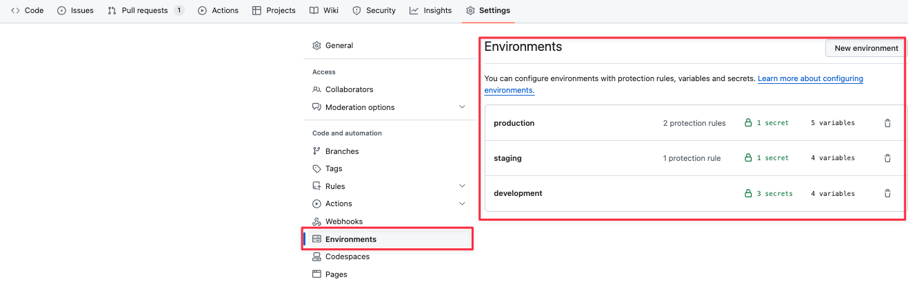

# Basic Branch Strategy

-   Create three environments
-   Adopt GitHub Flow
-   Push the image to Azure Container Registry and deploy to the dev slot when in feature/\*\*
-   Deploy to the staging slot when a pull request is made to the main branch
-   Swap staging slot with main after merging into main

# GitHub Actions File Structure

-   Place GitHub Actions files in .github/workflows/

-   build-and-deploy-to-dev.yml  
    Push the image to Azure Container Registry and deploy to the dev slot when in feature/\*\*

-   build-and-deploy-to-staging.yml
    Push to Azure Container Registry and deploy to the staging slot when a pull request is made to the main branch

-   swap-to-production.yml
    Swap staging slot with main after merging into main

# Resource Creation

This repository currently does not automate resource preparation.

For Laravel, please create:

-   App Service for Custom Container
-   Azure Container Registry (ACR)
-   Azure Database for MySQL or PostgreSQL
-   Azure Redis Cache

# Retrieving Azure Credentials from GitHub Actions

Create an Entra ID application to create a service principal.

Use the app_id of the service principal and the name of ACR to execute the following command.

Creation of Service Principal

```
az ad sp create-for-rbac --name "LaravelApp" --role contributor --scopes /subscriptions/{subscription-id}/resourceGroups/{resource-group} --json-auth
```

In this case, a service principal named "LaravelApp" is created and set to have Contributor privileges to a particular resource group.

The minimal permissions are push privileges to Azure Container Registry and pull and deploy privileges from App Service to Container Registry.

You will receive a JSON response like the following. (Secrets are masked.)

```
{
  "clientId": "18a16acf-58f2-4f02-b135-2437b81c6c57",
  "clientSecret": "*****",
  "subscriptionId": "f13a48a2-ca19-404e-900f-a64a7964cf24",
  "tenantId": "2494e1c1-e244-42f7-bc5f-1324bd28a449",
  "activeDirectoryEndpointUrl": "https://login.microsoftonline.com",
  "resourceManagerEndpointUrl": "https://management.azure.com/",
  "activeDirectoryGraphResourceId": "https://graph.windows.net/",
  "sqlManagementEndpointUrl": "https://management.core.windows.net:8443/",
  "galleryEndpointUrl": "https://gallery.azure.com/",
  "managementEndpointUrl": "https://management.core.windows.net/"
}
```

Set environment variables

```
export sp_app_id=xxxxxxxx-xxxx-xxxx-xxxx-xxxxxxxxxxxx // Service Principal app_id
export acr_name=xxxxxx // ACR name
```

Grant pull privileges to ACR to the service principal.

```
# Retrieve the resource ID of ACR

acr_id=$(az acr show --name $acr_name --query id --output tsv)

# Grant pull privileges to ACR to the service principal

az role assignment create --assignee $sp_app_id --role acrpull --scope $acr_id

```

By assigning this service principal to the corresponding App Service, the deployed App Service can access ACR.

# Setting Environment Variables in GitHub Actions

Example shown below.



This setup utilizes Environments.

Creating an Environment allows you to set environment variables tailored to each environment.

You can also set reviewers and protection rules for each environment.

Example of reviewer settings


When using, set the environment for each job in the GitHub yaml as follows.

```yaml
name: Swap to Production
on:
    push:
        branches:
            - main
jobs:
    swap-to-production:
        runs-on: ubuntu-latest
        environment: production
```

Environment variables are divided into Environment secrets and Environment Variables, so use them appropriately.

Environment Variables are less confidential. Use them in the form `vars.variable_name`.

Environment secrets are environment variables tied to the Environment. Use them in the form `secrets.variable_name`.

Example of variable settings

| Type                  | Environment Name    | Value                                |
| --------------------- | ------------------- | ------------------------------------ |
| Environment variables | ACR_NAME            | customcontainer15321                 |
| secrets               | AZURE_CREDENTIALS   | Above                                |
| Environment variables | WEBAPP_NAME         | custom-container-laravel             |
| Environment variables | IMAGE_NAME          | laravel-container                    |
| secrets               | AZURE_CLIENT_ID     | 18a16acf-58f2-4f02-b135-2437b81c6c57 |
| secrets               | AZURE_CLIENT_SECRET | CLIENT SECRET Value                  |

Wj9eI-2a5M |
| Environment variables | SLOT_NAME | custom-container-laravel-dev |
